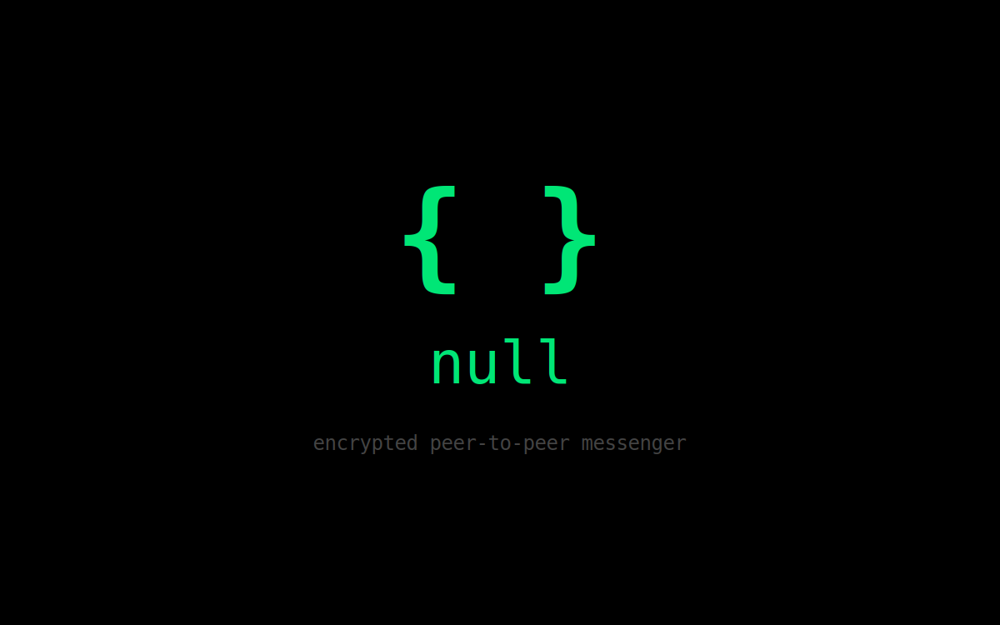

# null

**Encrypted Peer-to-Peer Messenger** — End-to-end encrypted messaging with disappearing messages, voice/video calling, crypto payments, and real-time presence detection.



## Live Demo
🌐 [null-messenger.vercel.app](https://null-messenger.vercel.app)

## Features
- End-to-end encrypted messaging
- Disappearing messages with configurable timers
- Read receipts and typing indicators
- Real-time online/offline presence detection
- Peer-to-peer voice and video calling
- In-conversation cryptocurrency payments
- Desktop app (Electron) and web client
- Zero-knowledge architecture — no message data stored on servers

## Tech Stack
- **Runtime**: TypeScript, React
- **Desktop**: Electron
- **Build**: Vite, Turborepo
- **Networking**: WebSocket signaling server
- **Crypto**: End-to-end encryption with modern cryptographic protocols

## Getting Started
```bash
git clone https://github.com/ryhoch/null.git
cd null
pnpm install
pnpm dev
```

## License
MIT
