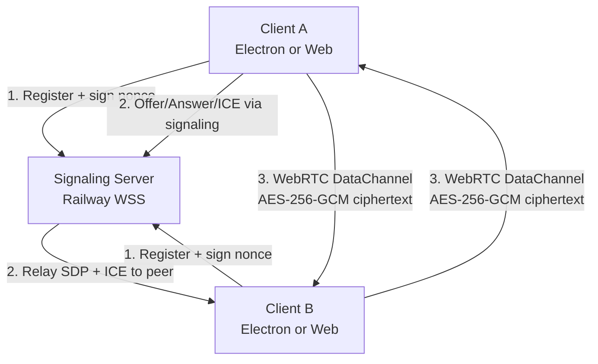
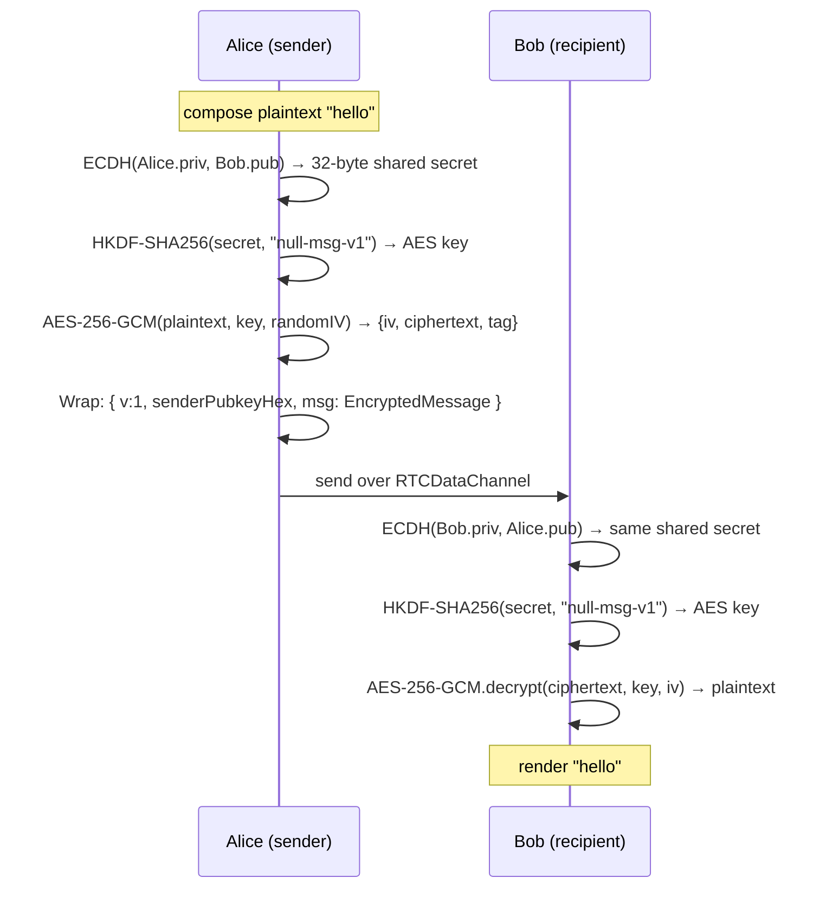
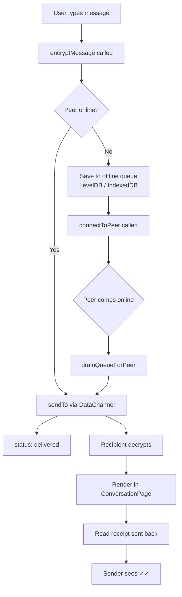
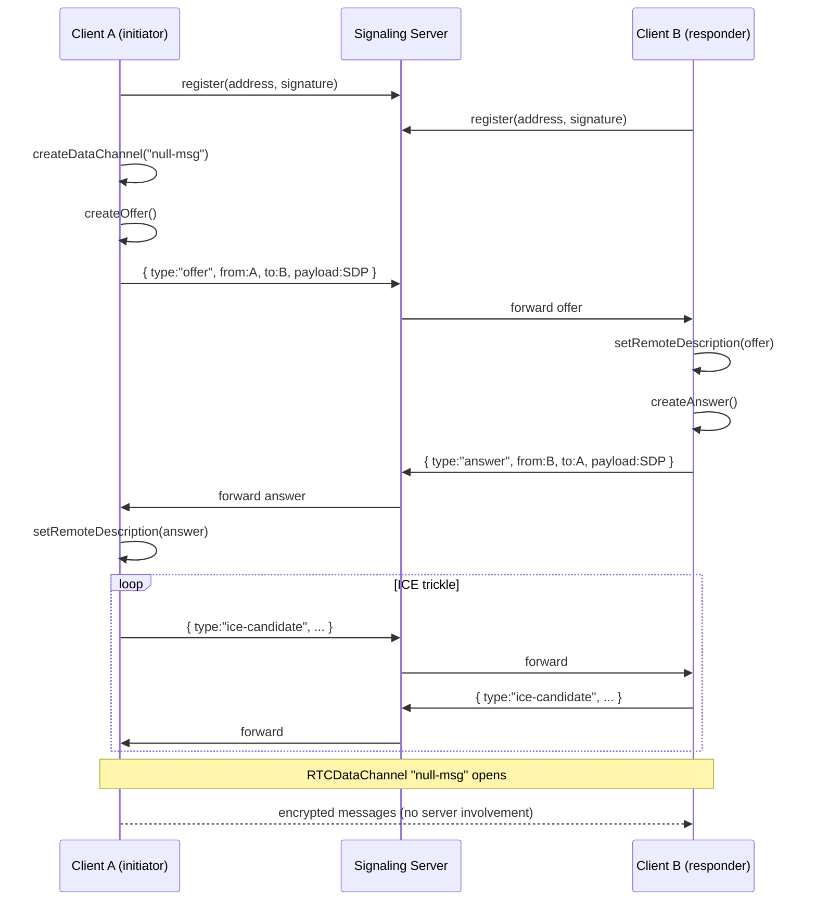
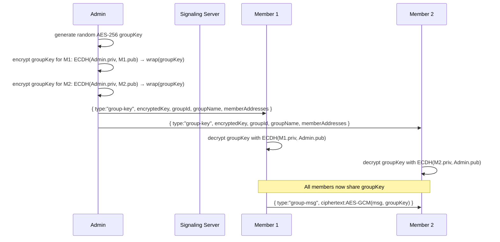

# null — Architecture

## System Overview



**Phase 1 — Registration:** Each client connects to the signaling server via WebSocket. The server issues a random nonce; the client signs it with their secp256k1 private key and sends the signature. The server verifies the signature against the claimed Ethereum address and adds the client to the in-memory registry.

**Phase 2 — WebRTC Handshake:** When Client A wants to message Client B, it sends an SDP offer through the signaling server. The server looks up Client B's WebSocket and forwards the offer. ICE candidates are similarly relayed. The signaling server sees only address strings, SDP blobs, and ICE candidates — never message content.

**Phase 3 — Direct P2P:** Once the WebRTC handshake completes, an `RTCDataChannel` opens directly between the two peers (or via a TURN relay if direct fails). All subsequent messages are encrypted payloads — the signaling server is no longer involved.

---

## Encryption Flow



### Key Derivation Details

- **Curve:** secp256k1 (same as Ethereum)
- **ECDH output:** 32-byte shared point x-coordinate
- **KDF:** HKDF-SHA256 with info string `"null-msg-v1"`, no salt
- **Cipher:** AES-256-GCM with 96-bit random IV per message
- **Authentication:** GCM tag provides integrity; tampered messages throw on decrypt and are silently dropped
- **Libraries:** `@noble/curves/secp256k1`, `@noble/hashes/hkdf`, WebCrypto AES-GCM

---

## Message Lifecycle



### Offline Queue

- Queue entries stored under `queue:{peerAddress}:{messageId}` in LevelDB/IndexedDB
- On peer reconnect, `drainQueueForPeer` reads all entries and retries
- **Max age:** 7 days — entries older than this are discarded
- **Max attempts:** 10 — messages that fail 10 times are marked failed
- **Status indicators:** ○ queued · ✓ delivered · ✓✓ read · ✗ failed

---

## WebRTC Connection Establishment



---

## Group Chat Key Distribution



**Group key properties:**
- Random 256-bit AES key, never transmitted in plaintext
- Individually wrapped for each member using ECDH + AES-GCM
- If a member is removed, the admin generates a new group key and redistributes
- Group key is stored in LevelDB/IndexedDB (as part of the `Group` record)

---

## Platform Abstraction

The entire React application communicates with the OS/browser exclusively through `window.nullBridge`:

```typescript
interface NullBridge {
  platform: string;          // "darwin" | "win32" | "linux" | "web"
  signalingUrl: string;      // WebSocket URL
  storage: {                 // Key-value store
    get(key): Promise<string | null>
    put(key, value): Promise<void>
    del(key): Promise<void>
    list(prefix): Promise<{key, value}[]>
  }
  system: {                  // OS utilities
    copyToClipboard(text): Promise<void>
    saveFile(name, bytes): Promise<string>
    openFileDialog(filters): Promise<string | null>
    writeIdentity(address, pubkeyHex): Promise<void>
    launchNova(): Promise<void>
  }
  onProtocolLink(cb): void   // null:// deep links (Electron only)
}
```

| Implementation | Backend | Where |
|---|---|---|
| **Electron** | `contextBridge` in preload.ts → IPC to main.ts → LevelDB | `packages/desktop/electron/` |
| **Web** | IndexedDB + Web Clipboard API + `<a download>` | `packages/web/src/web-bridge.ts` |

Because the React components never import Electron or Node APIs directly, the same component tree renders in both environments without modification.

---

## Storage Key Schema

All keys are stored in LevelDB (Electron) or IndexedDB (web) with the following namespace convention:

| Prefix | Contents |
|---|---|
| `keystore` | Encrypted secp256k1 keystore (JSON) |
| `wallet:pubkey` | Compressed public key hex |
| `contact:{address}` | `Contact` JSON |
| `msg:{peerAddr}:{paddedTs}:{msgId}` | `LocalMessage` JSON (sorted by timestamp) |
| `file:{peerAddr}:{transferId}` | File bytes (base64) |
| `gmsg:{groupId}:{paddedTs}:{msgId}` | Group `LocalMessage` JSON |
| `group:{groupId}` | `Group` JSON (includes groupKeyHex) |
| `conv-meta:{address}` | `{ disappearAfterMs }` |
| `group-meta:{groupId}` | `{ disappearAfterMs }` |
| `queue:{peerAddr}:{msgId}` | Offline queue `QueueEntry` JSON |
| `identity:address` | Own address (for Nova cross-app linking) |
| `identity:pubkey` | Own public key (for Nova cross-app linking) |
